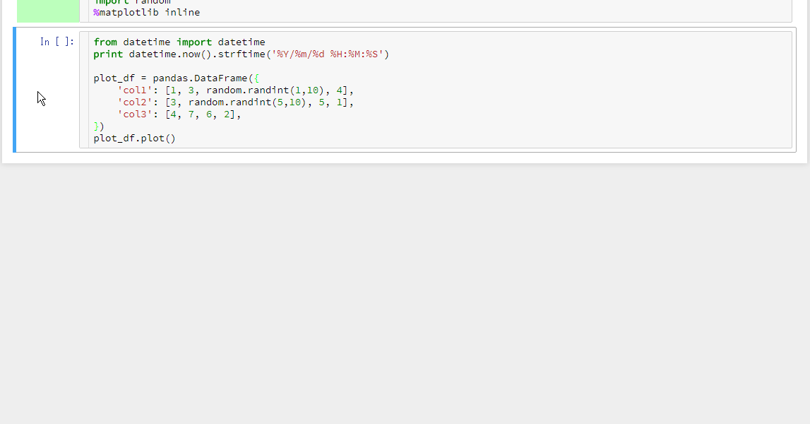
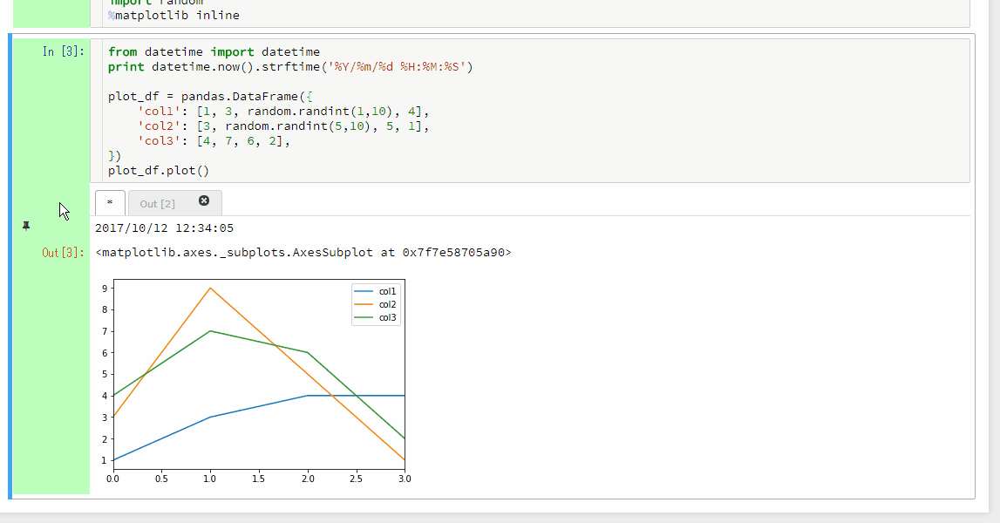

# Introduction

This extension enables to keep multiple results as tabs in output_area.
You can also save/load tabbed outputs as far as this extension is enabled
As default behavior the "output_area" under a code cell is cleared and over written in each execution.  

# Feature

* Pin button for saving outputs
* Visualization of each code cell's executing status with colors
* Diff dialog for comparing pinned outputs with current outputs
* Search feature in the diff dialog

# How to install

To install the multi_outputs extension, the following steps are required.

## Install the python package

Install the `lc_multi_outputs` python package.

```
pip install git+https://github.com/NII-cloud-operation/Jupyter-multi_outputs
```

## Install extension files

Copy the nbextension files into the jupyter server's search directory.

```
jupyter nbclassic-extension install --py lc_multi_outputs --user
```

About details of `jupyter nbclassic-extension` subcommand, execute this command with `--help` option, and see the results.

```
jupyter nbclassic-extension --help
```

## Enabling extension

To use the multi_outputs extension, you will also need to enable it.

```
jupyter nbclassic-extension enable --py lc_multi_outputs --user
```

# Usage

## Save current outputs

1. Execute a code cell
2. Select the current output (leftmost) tab (if output tabs exist)
3. Click the pin button in the output prompt area



## Execution status color of code cell

The prompt area of code cell displays execution status with colors.
The colors mean as follows:

- White: Not Executed
- Light cyan: Awaiting Execution
- Green: Successfully Executed
- Pink: Failed

## Diff dialog

You can compare pinned output with current output.

1. Select the pinned output tab you want to compare with current output
2. Click the diff button in the output prompt area

You can search keyword from the outputs compared in the diff dialog.
To search, input keyword to the search field and press the Enter key.



# Internals

The pinned outputs are saved as cell metadata.

This is an example of a code cell
```
{
 "cell_type": "code",
 "execution_count": 2,
 "metadata": {
  "pinned_outputs": [
   {
    "execution_count": 1,
    "outputs": [
     {
      "data": {
       "text/plain": "'2017/10/12 13:36:42'"
      },
      "execution_count": 1,
      "metadata": {},
      "output_type": "execute_result"
     }
    ]
   }
  ]
 },
 "outputs": [
  {
   "data": {
    "text/plain": [
     "'2017/10/12 13:36:49'"
    ]
   },
   "execution_count": 2,
   "metadata": {},
   "output_type": "execute_result"
  }
 ],
 "source": [
  "from datetime import datetime\n",
  "datetime.now().strftime('%Y/%m/%d %H:%M:%S')"
 ]
}
```

## Uninstall

To remove the extension, execute:

```bash
pip uninstall lc_multi_outputs
```

## Contributing

### Development install

Note: You will need NodeJS to build the extension package.

The `jlpm` command is JupyterLab's pinned version of
[yarn](https://yarnpkg.com/) that is installed with JupyterLab. You may use
`yarn` or `npm` in lieu of `jlpm` below.

```bash
# Clone the repo to your local environment
# Change directory to the lc_multi_outputs directory
# Install package in development mode
pip install -e .
# Link your development version of the extension with JupyterLab
jupyter labextension develop . --overwrite
# Rebuild extension Typescript source after making changes
jlpm build
```

You can watch the source directory and run JupyterLab at the same time in different terminals to watch for changes in the extension's source and automatically rebuild the extension.

```bash
# Watch the source directory in one terminal, automatically rebuilding when needed
jlpm watch
# Run JupyterLab in another terminal
jupyter lab
```

With the watch command running, every saved change will immediately be built locally and available in your running JupyterLab. Refresh JupyterLab to load the change in your browser (you may need to wait several seconds for the extension to be rebuilt).

By default, the `jlpm build` command generates the source maps for this extension to make it easier to debug using the browser dev tools. To also generate source maps for the JupyterLab core extensions, you can run the following command:

```bash
jupyter lab build --minimize=False
```

### Development uninstall

```bash
pip uninstall lc_multi_outputs
```

In development mode, you will also need to remove the symlink created by `jupyter labextension develop`
command. To find its location, you can run `jupyter labextension list` to figure out where the `labextensions`
folder is located. Then you can remove the symlink named `lc_multi_outputs` within that folder.

### Packaging the extension

See [RELEASE](RELEASE.md)

# License

This project is licensed under the terms of the Modified BSD License (also known as New or Revised or 3-Clause BSD), see LICENSE.txt.
