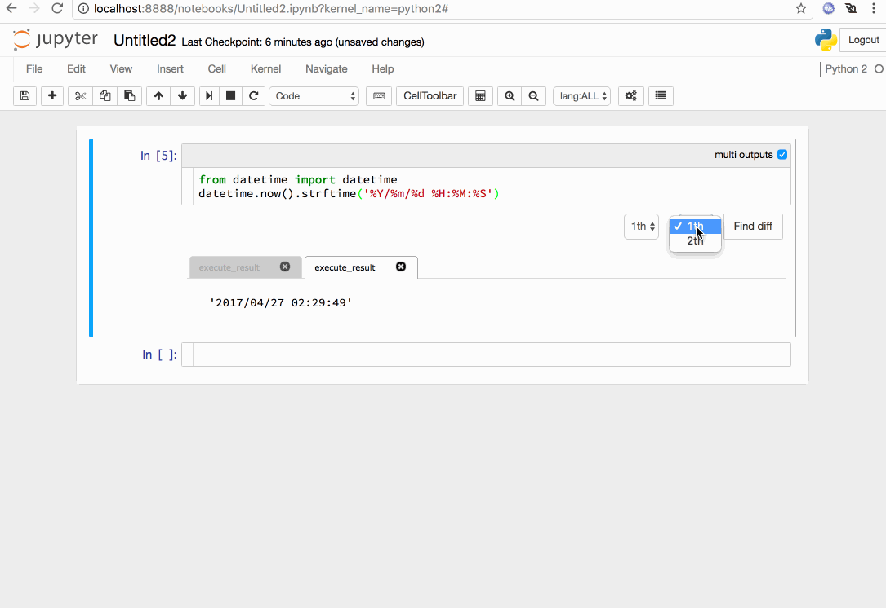
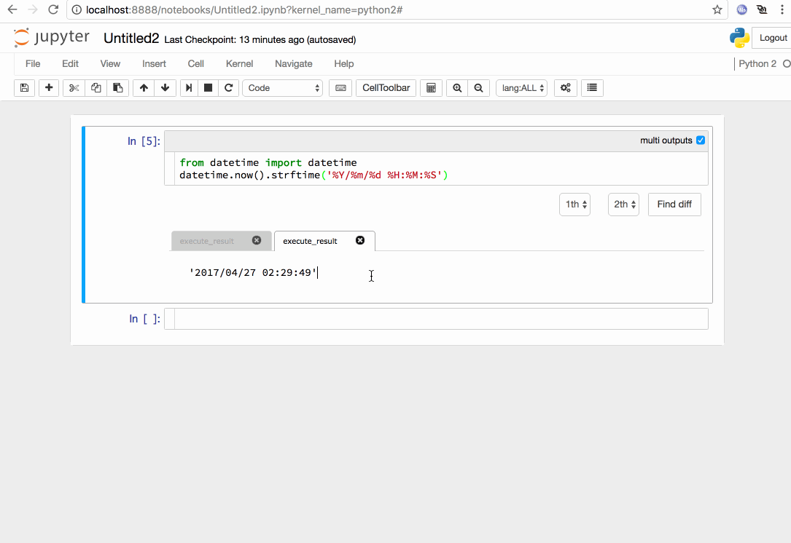

# Introduction

このJupyter notebook extensionは、コードセルのアウトプットをタブ化し、複数のアウトプットの保存を可能にします。

This extension enables to keep multiple results as tabs in output_area.
You can also save/load tabbed outputs as far as this extension is enabled
As default behavior the "output_area" under a code cell is cleared and over written in each execution.  

# Feature

* Add diff feature
* Add search feature

# Setup

## Instration

1. make the `nbextensions` folder to `~/.ipython/`
2. copy the `multi_outputs` folder to `~/.ipython/nbextensions/`

## Configuration

1. make (or edit) youre `~/.jupyter/nbconfig/notebook.json` file

    ```
    {
      "load_extensions": {
        "multi_outputs/main": true
      }
    }
    ```

1. Edit the .jupyter/jupyter_notebook.json to look like this

    ```
    {
      "Exporter": {
        "preprocessors": [
          "pre_codefolding.CodeFoldingPreprocessor",
          "pre_pymarkdown.PyMarkdownPreprocessor"
        ]
      },
      "NbConvertApp": {
        "postprocessor_class": "post_embedhtml.EmbedPostProcessor"
      },
      "NotebookApp": {
        "server_extensions": [
          "nbextensions"
        ]
      },
      "version": 1
    }
    ```

    Edit the .jupyter/jupyter_nbconvert.json to look like this:

    ```
      {
        "Exporter": {
          "preprocessors": [
            "pre_codefolding.CodeFoldingPreprocessor",
            "pre_pymarkdown.PyMarkdownPreprocessor"
          ]
        },
        "NbConvertApp": {
          "postprocessor_class": "post_embedhtml.EmbedPostProcessor"
        },
        "version": 1
      }
    ```

    This procedure referred to https://github.com/ipython-contrib/IPython-notebook-extensions

# Usage

1. メニューの[View] - [Cell Toolbar] - [Multi outputs]を選びます
1. セルのツールバーにmulti outputsチェックボックスが表示されるので、複数の出力を保持したいセルのチェックボックスをonにします
1. チェックボックスをonにしたセルを実行すると、実行結果をタブ形式で表示します。
  - タブを削除することも可能です。


5. Diff表示を行うためには、プルダウンからタブ番号を指定し、[Find diff]ボタンを押下してください。
To get diff display, select the tab number from the pull down menu and press the `Find diff' button.



6. 選択したアウトプット内で検索を行うには、アウトプット領域を選択し、Cmd+Fを押下してください。
To search within the outputarea, select the output area and press `Cmd+F`.




# Limitations and Known Issues

1. タブの内容は、.ipynbファイルではこのようにセルのoutputs配列の要素として保存されます。

    multiple outputs, i.e. tabs, are saved as elements of "outputs" array into .ipynb

    ```
    {
     "cells": [
      {
       "cell_type": "code",
       "execution_count": 2,
       "metadata": {
        "collapsed": false,
        "multi_outputs": true
       },
       "outputs": [
        {
         "data": {
          "text/plain": [
           "'2016/06/29 04:53:34'"
          ]
         },
         "execution_count": 1,
         "metadata": {},
         "output_type": "execute_result"
        },
        {
         "data": {
          "text/plain": [
           "'2016/06/29 04:53:36'"
          ]
         },
         "execution_count": 2,
         "metadata": {},
         "output_type": "execute_result"
        }
       ],
       "source": [
        "from datetime import datetime\n",
        "datetime.now().strftime('%Y/%m/%d %H:%M:%S')"
       ]
      }
     ],
     "metadata": {
    ~~~ After that it is omitted ~~~
    ```

1. stream タイプのレスポンスは正しく表示・保存が可能です。しかし、display_data, execution_result または errorタイプのレスポンスの場合は1つでなければなりません。
    例えば、pyplotはdisplay_dataとexecution_resultを1つずつ返しますが、この場合表示が壊れます。

    stream response(s) are fine.  However, the response of display_data, execution_result and error types should be only once.  
    For example, pyplot emits both one display_data and one execution_result. This will break the views.

    ```
    %matplotlib inline
    import numpy
    from matplotlib import pyplot
    x = numpy.arange(0, 10, 0.2)
    y = numpy.cos(x)
    pyplot.plot(x,y)
    ```

    この場合、pyplot.show()を明示的に指定するとdisplay_dataのみが返され、タブに正しく表示されます。

    When you explicitly specify "pyplot.show", the execution_result is suppressed then tabs work fine.

# License

This project is licensed under the terms of the Modified BSD License (also known as New or Revised or 3-Clause BSD), see LICENSE.txt.
